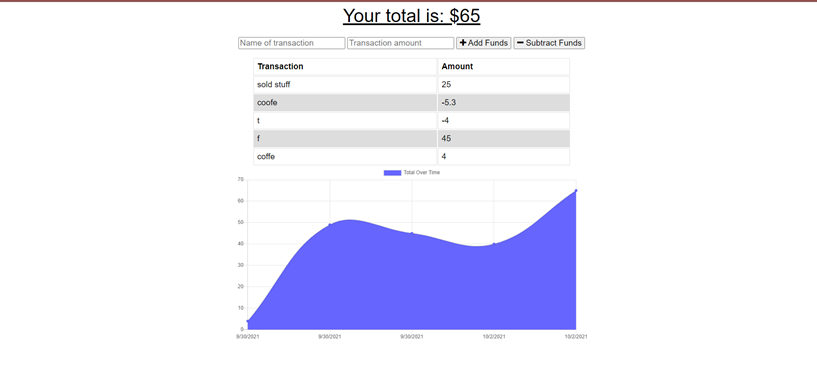

# Budget Trackers (PWA)

## Discription 

Budget Tracker is a progressive web application that allows users to track their budgets by adding expenses and deposits to their budget through the "Add/Subtract Funds" buttons. They are able to add a transaction with or without a connection. When a user enters a transaction while offline, these transactions are stored in the indexedDB, and transferred to the database when the user comes back online.

Offline Functionality:

  * Enter deposits offline

  * Enter expenses offline

When brought back online:

  * Offline entries should be added to tracker.

## Table of Content 

[Discription]()

[Deployed-Link]()

[User Story]()

[Instalation]()

[Usage]()

[Questions]()

[Acknowledgments]()

## Deployed-Link

https://progresive-budgettracker.herokuapp.com/

## User Story
AS AN avid traveller
I WANT to be able to track my withdrawals and deposits with or without a data/internet connection
SO THAT my account balance is accurate when I am traveling

## Instalation 

To install the required dependencies, run npm install

This package assumes there is a MongoDB server running on localhost:27017. If your server is running somewhere else, you can edit server.js to reflect that.

## Usage 

## Questions

GitHub: [github.com/kelebetengida]()

Email: [engidk@uw.edu]()

## Acknowledgments

Thankkyou to my instractors who have helped me through the learning curve of this project. 
